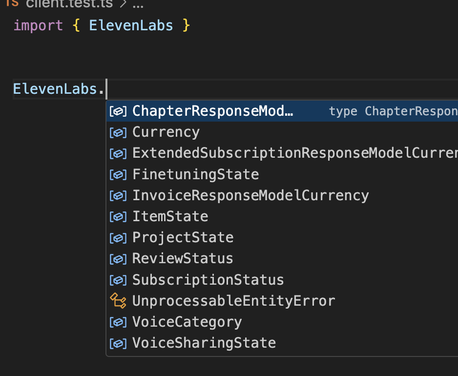

# ElevenLabs JS Library


[](https://buildwithfern.com/?utm_source=fern-elevenlabs/elevenlabs-python/readme)
[](https://discord.gg/elevenlabs)
[](https://twitter.com/elevenlabsio)
[](https://www.npmjs.com/package/elevenlabs)

> **Note:** This is the Node.js library for ElevenLabs. For the browser SDK, visit [`@11labs/client`](https://www.npmjs.com/package/@11labs/client). For the React SDK, check out [`@11labs/react`](https://www.npmjs.com/package/@11labs/react).

The official JS API for [ElevenLabs](https://elevenlabs.io/) [text-to-speech software.](https://elevenlabs.io/text-to-speech) Eleven brings the most compelling, rich and lifelike voices to creators and developers in just a few lines of code.

## 📖 API & Docs

Check out the [HTTP API documentation](https://elevenlabs.io/docs/api-reference).

## ⚙️ Install

```bash
npm install elevenlabs
# or
yarn add elevenlabs
```

## 🗣️ Usage

[](https://huggingface.co/spaces/elevenlabs/tts)
[](https://colab.research.google.com/gist/flavioschneider/49468d728a816c6538fd2f56b3b50b96/elevenlabs-python.ipynb)

### Main Models

1. **Eleven Multilingual v2** (`eleven_multilingual_v2`)

    - Excels in stability, language diversity, and accent accuracy
    - Supports 29 languages
    - Recommended for most use cases

2. **Eleven Flash v2.5** (`eleven_flash_v2_5`)

    - Ultra-low latency
    - Supports 32 languages
    - Faster model, 50% lower price per character

2. **Eleven Turbo v2.5** (`eleven_turbo_v2_5`)

    - Good balance of quality and latency
    - Ideal for developer use cases where speed is crucial
    - Supports 32 languages

For more detailed information about these models and others, visit the [ElevenLabs Models documentation](https://elevenlabs.io/docs/speech-synthesis/models).

```ts
import { ElevenLabsClient, play } from "elevenlabs";

const elevenlabs = new ElevenLabsClient({
    apiKey: "YOUR_API_KEY", // Defaults to process.env.ELEVENLABS_API_KEY
});

const audio = await elevenlabs.textToSpeech.convert("Xb7hH8MSUJpSbSDYk0k2", {
    text: "Hello! 你好! Hola! नमस्ते! Bonjour! こんにちは! مرحبا! 안녕하세요! Ciao! Cześć! Привіт! வணக்கம்!",
    model_id: "eleven_multilingual_v2",
});

await play(audio);
```

<details> <summary> Play </summary>

<i> Don't forget to unmute the player! </i>

[audio (3).webm](https://github.com/elevenlabs/elevenlabs-python/assets/12028621/778fd3ed-0a3a-4d66-8f73-faee099dfdd6)

</details>

⚠️ elevenlabs-js requires [MPV](https://mpv.io/) and [ffmpeg](https://ffmpeg.org/) to play audio.

## 🗣️ Voices

List all your available voices with `getAll()`.

```ts
import { ElevenLabsClient } from "elevenlabs";

const elevenlabs = new ElevenLabsClient({
    apiKey: "YOUR_API_KEY", // Defaults to process.env.ELEVENLABS_API_KEY
});

const voices = await elevenlabs.voices.getAll();
```

For information about the structure of the voices output, please refer to the [official ElevenLabs API documentation for Get Voices](https://elevenlabs.io/docs/api-reference/get-voices).

## 🚿 Streaming

Stream audio in real-time, as it's being generated.

```ts
const audioStream = await elevenlabs.textToSpeech.convertAsStream("JBFqnCBsd6RMkjVDRZzb", {
    text: "This is a... streaming voice",
    model_id: "eleven_multilingual_v2",
});

stream(audioStream);
```

## Retries

This Node SDK is instrumented with automatic retries with exponential backoff. A request will be
retried as long as the request is deemed retriable and the number of retry attempts has not grown larger
than the configured retry limit (default: 2).

A request is deemed retriable when any of the following HTTP status codes is returned:

-   [408](https://developer.mozilla.org/en-US/docs/Web/HTTP/Status/408) (Timeout)
-   [409](https://developer.mozilla.org/en-US/docs/Web/HTTP/Status/409) (Conflict)
-   [429](https://developer.mozilla.org/en-US/docs/Web/HTTP/Status/429) (Too Many Requests)
-   [5XX](https://developer.mozilla.org/en-US/docs/Web/HTTP/Status/500) (Internal Server Errors)

Use the `maxRetries` request option to configure this behavior.

```ts
const response = await elevenlabs.voices.getAll(
    {},
    {
        maxRetries: 2, // Set the maximum number of retries
    }
);
```

## Timeouts

The SDK defaults to a 60 second timout. Use the `timeoutInSeconds` option to
configure this behavior.

```ts
const response = await elevenlabs.voices.getAll(
    {},
    {
        timeoutInSeconds: 30, // override timeout to 30s
    }
);
```

## Runtime compatiblity

The SDK defaults to `node-fetch` but will use the global fetch client if present. The SDK
works in the following runtimes:

The following runtimes are supported:

-   Node.js 15+
-   Vercel
-   Cloudflare Workers
-   Deno v1.25+
-   Bun 1.0+

## Elevenlabs Namespace

All of the ElevenLabs models are nested within the `ElevenLabs` namespace.



## Languages Supported

We support 32 languages and 100+ accents. Explore [all languages](https://elevenlabs.io/languages).


## Contributing

While we value open-source contributions to this SDK, this library is generated programmatically. Additions made directly to this library would have to be moved over to our generation code, otherwise they would be overwritten upon the next generated release. Feel free to open a PR as a proof of concept, but know that we will not be able to merge it as-is. We suggest opening an issue first to discuss with us!

On the other hand, contributions to the README are always very welcome!
