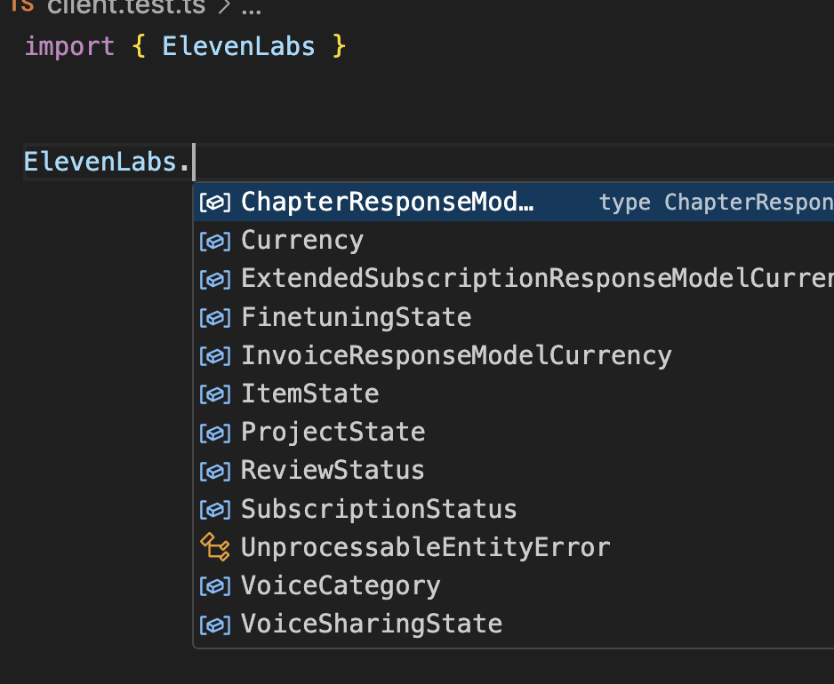

# ElevenLabs JS Library


[](https://buildwithfern.com/?utm_source=fern-elevenlabs/elevenlabs-python/readme)
[](https://discord.gg/elevenlabs)
[](https://twitter.com/elevenlabsio)
[](https://www.npmjs.com/package/@elevenlabs/elevenlabs-js)

> **Note:** This is the Node.js library for ElevenLabs. For the browser SDK, visit [`@elevenlabs/client`](https://www.npmjs.com/package/@elevenlabs/client). For the React SDK, check out [`@elevenlabs/react`](https://www.npmjs.com/package/@elevenlabs/react).

The official Node SDK for [ElevenLabs](https://elevenlabs.io/). ElevenLabs brings the most compelling, rich and lifelike voices to creators and developers in just a few lines of code.

## 📖 API & Docs

Check out the [HTTP API documentation](https://elevenlabs.io/docs/api-reference).

## ⚙️ Install

```bash
npm install @elevenlabs/elevenlabs-js
# or
yarn add @elevenlabs/elevenlabs-js
```

### Main Models

1. **Eleven Multilingual v2** (`eleven_multilingual_v2`)
    - Excels in stability, language diversity, and accent accuracy
    - Supports 29 languages
    - Recommended for most use cases

2. **Eleven Flash v2.5** (`eleven_flash_v2_5`)
    - Ultra-low latency
    - Supports 32 languages
    - Faster model, 50% lower price per character

3. **Eleven Turbo v2.5** (`eleven_turbo_v2_5`)
    - Good balance of quality and latency
    - Ideal for developer use cases where speed is crucial
    - Supports 32 languages

For more detailed information about these models and others, visit the [ElevenLabs Models documentation](https://elevenlabs.io/docs/models).

```ts
import { ElevenLabsClient, play } from "@elevenlabs/elevenlabs-js";

const elevenlabs = new ElevenLabsClient({
    apiKey: "YOUR_API_KEY", // Defaults to process.env.ELEVENLABS_API_KEY
});

const audio = await elevenlabs.textToSpeech.convert("Xb7hH8MSUJpSbSDYk0k2", {
    text: "Hello! 你好! Hola! नमस्ते! Bonjour! こんにちは! مرحبا! 안녕하세요! Ciao! Cześć! Привіт! வணக்கம்!",
    modelId: "eleven_multilingual_v2",
});

await play(audio);
```

<details> <summary> Play </summary>

<i> Don't forget to unmute the player! </i>

[audio (3).webm](https://github.com/elevenlabs/elevenlabs-python/assets/12028621/778fd3ed-0a3a-4d66-8f73-faee099dfdd6)

</details>

⚠️ elevenlabs-js requires [MPV](https://mpv.io/) and [ffmpeg](https://ffmpeg.org/) to play audio.

## 🗣️ Voices

List all your available voices with `search()`.

```ts
import { ElevenLabsClient } from "@elevenlabs/elevenlabs-js";

const elevenlabs = new ElevenLabsClient({
    apiKey: "YOUR_API_KEY", // Defaults to process.env.ELEVENLABS_API_KEY
});

const voices = await elevenlabs.voices.search();
```

For information about the structure of the voices output, please refer to the [official ElevenLabs API documentation for Get Voices](https://elevenlabs.io/docs/api-reference/get-voices).

## 🚿 Streaming

Stream audio in real-time, as it's being generated.

```ts
const audioStream = await elevenlabs.textToSpeech.stream("JBFqnCBsd6RMkjVDRZzb", {
    text: "This is a... streaming voice",
    modelId: "eleven_multilingual_v2",
});

stream(audioStream);
```

## Voice Engine

Voice Engine lets you build voice-powered AI agents with a custom LLM or add voice to your existing chat agent. The ElevenLabs API connects to your server via WebSocket — each connection represents one conversation. You provide the LLM responses, ElevenLabs handles the speech.

There are two ways to set up a Voice Engine server:

### Attach to an existing HTTP server

Use this when you already have a web server (Express, Next.js, Fastify, etc.) and want to handle Voice Engine connections on a specific path alongside your existing routes. Configure your voice engine's server URL to point to the path you choose, e.g. `https://myapp.com/api/voice-engine/ws`.

```ts
import { ElevenLabsClient } from "@elevenlabs/elevenlabs-js";
import OpenAI from "openai";

const elevenlabs = new ElevenLabsClient({
    apiKey: process.env.ELEVENLABS_API_KEY,
});
const openai = new OpenAI({
    apiKey: process.env.OPENAI_API_KEY,
});

// Attach Voice Engine to existing server
await elevenlabs.voiceEngine.attach("veng_123", httpServer, "/api/voice-engine/ws", {
    debug: true,

    onInit(conversationId) {
        console.log("session started:", conversationId);
    },

    async onTranscript(transcript, signal, session) {
        // Pass the transcript to your LLM — signal auto-aborts if the user interrupts
        const response = await openai.responses.create(
            {
                model: "gpt-4o",
                instructions: "You are a helpful agent that assists developers in testing SDKs. Help users explore SDK features, debug integration issues, and validate that SDK methods work as expected.",
                input: transcript.map((m) => ({ role: m.role === "agent" ? "assistant" : m.role, content: m.content })),
                stream: true,
            },
            { signal },
        );

        // Stream the LLM response directly — the SDK extracts text from
        // OpenAI, Anthropic, and Gemini stream formats automatically
        session.sendResponse(response);
    },

    onClose(session) {
        console.log("session ended:", session.conversationId);
    },

    onDisconnect(session) {
        console.log("session disconnected:", session.conversationId);
    },

    onError(err) {
        console.error("error:", err);
    },
});
```

### Standalone server

Use this when you want a dedicated server just for Voice Engine — no existing HTTP server needed. It starts a WebSocket server on the given port and every connection is treated as a voice engine session. Configure your voice engine's server URL to point to the host and port directly, e.g. `wss://myserver.com:3001`.

```ts
import { VoiceEngine } from "@elevenlabs/elevenlabs-js";

const server = new VoiceEngine.Server({
    port: 3001,
    async onTranscript(transcript, signal, session) {
        const reply = await generateLLMResponse(transcript, { signal });
        session.sendResponse(reply);
    },
});

server.start();
```

### Session events

| Event | Method | Description |
|---|---|---|
| `user_transcript` | `onTranscript` | User speech transcribed — includes full conversation history and an abort signal |
| `init` | `onInit` | Session initialized with a conversation ID |
| `close` | `onClose` | Clean disconnect from ElevenLabs |
| `disconnected` | `onDisconnect` | WebSocket dropped unexpectedly |
| `error` | `onError` | Protocol or WebSocket error |

## Retries

This Node SDK is instrumented with automatic retries with exponential backoff. A request will be
retried as long as the request is deemed retry-able and the number of retry attempts has not grown larger
than the configured retry limit (default: 2).

A request is deemed able to retry when any of the following HTTP status codes is returned:

- [408](https://developer.mozilla.org/en-US/docs/Web/HTTP/Status/408) (Timeout)
- [409](https://developer.mozilla.org/en-US/docs/Web/HTTP/Status/409) (Conflict)
- [429](https://developer.mozilla.org/en-US/docs/Web/HTTP/Status/429) (Too Many Requests)
- [5XX](https://developer.mozilla.org/en-US/docs/Web/HTTP/Status/500) (Internal Server Errors)

Use the `maxRetries` request option to configure this behavior.

```ts
const response = await elevenlabs.voices.search(
    {},
    {
        maxRetries: 2, // Set the maximum number of retries
    },
);
```

## Timeouts

The SDK defaults to a 60 second timeout. Use the `timeoutInSeconds` option to
configure this behavior.

```ts
const response = await elevenlabs.voices.search(
    {},
    {
        timeoutInSeconds: 30, // override timeout to 30s
    },
);
```

## Runtime compatibility

The SDK defaults to `node-fetch` but will use the global fetch client if present. The SDK
works in the following runtimes:

The following runtimes are supported:

- Node.js 15+
- Vercel
- Cloudflare Workers
- Deno v1.25+
- Bun 1.0+

## Elevenlabs Namespace

All of the ElevenLabs models are nested within the `ElevenLabs` namespace.



## Languages Supported

Explore [all models & languages](https://elevenlabs.io/docs/models).

## Contributing

While we value open-source contributions to this SDK, this library is generated programmatically. Additions made directly to this library would have to be moved over to our generation code, otherwise they would be overwritten upon the next generated release. Feel free to open a PR as a proof of concept, but know that we will not be able to merge it as-is. We suggest opening an issue first to discuss with us!

On the other hand, contributions to the README are always very welcome!
